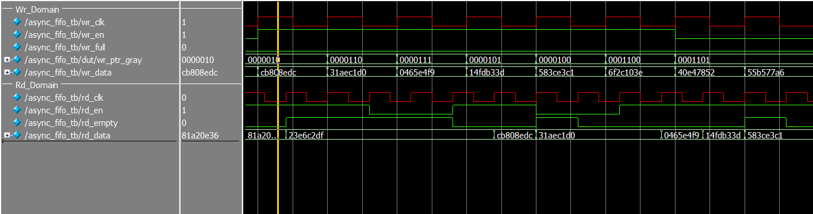

# Asynchronous FIFO in SystemVerilog 

## Overview
This project implements a parameterized asynchronous FIFO in SystemVerilog for safe data transfer between independent write and read clock domains.

The design uses:
- Gray coded read and write pointers
- Multistage clock domain crossing synchronizers
- Full and empty detection based on synchronized Gray pointers
- Registered read data output with 1-cycle read latency

In addition to the reusable FIFO RTL, the repo includes:
- a simulation testbench with a mailbox based scoreboard
- an FPGA self test wrapper (`top_fifo_bist.sv`) that continuously writes and reads patterned data and latches any mismatch

## Files
- `rtl/async_fifo.sv` — core asynchronous FIFO RTL
- `sim/async_fifo_tb.sv` — simulation testbench with randomized write/read activity (LFSR) and scoreboard checking
- `fpga/top_fifo_bist.sv` — FPGA builtin self test wrapper for hardware validation
- `ip/rd_clk.qip` — Quartus IP integration file for read lock PLL
- `ip/rd_clk.v` — generated PLL module used by the BIST wrapper

## Features
- Parameterized data width (`DATA_W`)
- Parameterized FIFO depth (`DEPTH`)
- Parameterized number of CDC synchronizer stages (`SYNC_STAGES`)
- Power of two depth checking at compile time
- Independent write and read clocks
- Independent active low resets in each domain
- Full and empty status flags
- Registered read data path

## Design Summary

### FIFO architecture
The FIFO stores data in a memory array indexed by binary read and write pointers. Each domain maintains:
- a binary pointer for memory addressing
- a Gray coded pointer for safe clock domain crossing

The synchronized Gray pointers are used for full/empty detection:
- `wr_full` is asserted when the next write pointer matches the synchronized read pointer with the upper bits inverted
- `rd_empty` is asserted when the next/current read pointer matches the synchronized write pointer

### Clock domain crossing
The design crosses only Gray coded pointers between domains.  
Each pointer passes through a configurable multi stage synchronizer, with `SYNC_STAGES >= 2`.

### Read behavior
Read data is **registered** on the read clock when a valid read occurs.  
This means the FIFO has a **1-cycle read latency**, which is reflected in both the testbench and the FPGA self test checker.

## Parameters

| Parameter | Description | Default |
|---|---|---:|
| `DATA_W` | Data width in bits | `32` |
| `DEPTH` | FIFO depth, must be a power of two | `64` |
| `SYNC_STAGES` | Number of synchronizer stages for Gray pointers | `2` |

## Interface

### Write domain
- `wr_clk` — write clock
- `wr_rst_n` — active low write reset
- `wr_en` — write request
- `wr_data` — write data
- `wr_full` — FIFO full flag

### Read domain
- `rd_clk` — read clock
- `rd_rst_n` — active low read reset
- `rd_en` — read request
- `rd_data` — registered read data output
- `rd_empty` — FIFO empty flag

## Verification

### Simulation testbench
The included testbench verifies the FIFO using:
- unrelated write and read clock frequencies
- randomized write enables and data
- randomized read enables
- a mailbox based scoreboard
- 1-cycle delayed comparison to match the registered read path

Testbench clocks:
- write clock: 50 MHz
- read clock: 83.33 MHz

Testbench flow:
1. apply asynchronous reset timing to the two domains
2. generate randomized write/read traffic
3. push successful writes into a scoreboard mailbox
4. compare successful reads against expected data one cycle later
5. stop writes near the end of simulation and drain the FIFO

The testbench terminates with `$fatal` on:
- scoreboard underflow
- data mismatch

## Example Waveforms

### Write/read activity across asynchronous clocks

## FPGA self test wrapper
`top_fifo_bist.sv` is a board level hardware validation wrapper around the FIFO.

It:
- drives writes using a counter pattern
- gates write/read attempts with independent LFSRs
- compares read data against the expected sequence
- latches any mismatch until reset
- exposes status on LEDs

This wrapper is included as a hardware validation aid, not as part of the reusable FIFO core.

## Notes and Constraints
- `DEPTH` must be a power of two
- `DEPTH >= 2`
- `SYNC_STAGES >= 2`
- read data is registered, so consumers must account for 1-cycle latency
- the FPGA BIST wrapper depends on a PLL IP module for `rd_clk`